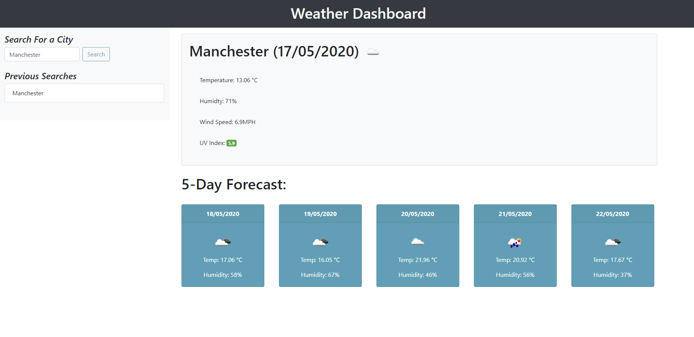
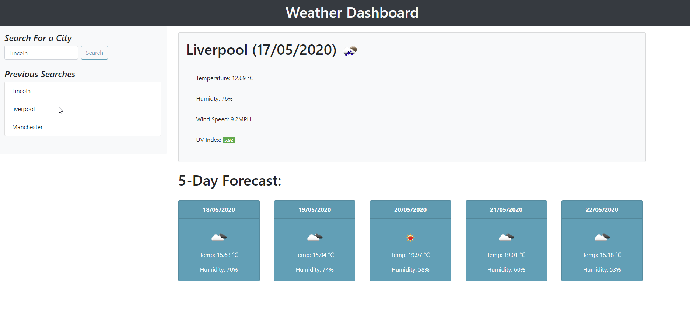
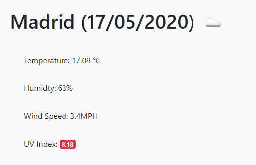

# Weather Forecast Dashboard

For this application, the user has requested for a weather forecast dashboard that will search a destination the user has entered and return the current day's weather along with a forecast for the following 5 days. The user will also be able to click on previously searched destinations to bring back up to date weather information.

## Functionality
- When the user searches a valid destination (city, country, county etc), the user is presented with with an up-to-date weather forecast for the next 5 days
- In the current weather, the user will be able to the location they searched for, current date, temperature (in celsius), humidity, wind speed, UV index as well as an icon that shows a visual representation of the day's weather
- The UV index number is accompanied by a colour box indicating weather the level is considered high (red), mid (green), or low (yellow).
- In the five day forecast, the user is shown the weather forecast for the following five days which includes the icon representation, temperature in celsius as well as the humidity percentage
- If the user wishes to search back a previously searched destination they're given an option to click the previously searched area to bring back this information, up to 5 previous searches will be stored.
- When a user inputs an invalid search an alert will pop up notifying them to input a valid search

The weather forecast dashboard is accessible here: 

## Images

image 1: successful search

image 2: previous search

image 3: failed search

image 4: UV Index indicator & icon change

